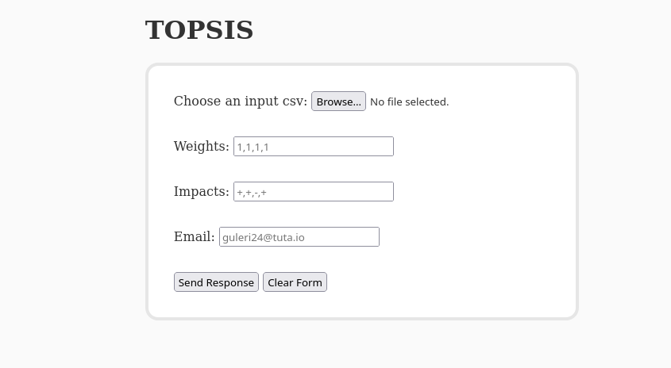

# TOPSIS

A simple web service written for TOPSIS method computation and send the result to the email provided.

Browse - add the data csv

Weights - add comma seperated integers

Impacts - add comma seperated symbols + or -

Email - add a valid email address

#### In order to install dependencies mentioned in the requirements.txt file, all you have to do is to run the following command.
    pip install -r requirements.txt

#### Run - locally
    uvicorn --port 5000 --host 127.0.0.1 main:app --reload

### Email service setup
Add your email and app password in the main.py.
[how-to-configure-gmail-smtp](https://support.cloudways.com/en/articles/5131076-how-to-configure-gmail-smtp)

Read this article for more info [python-send-email](https://realpython.com/python-send-email/)